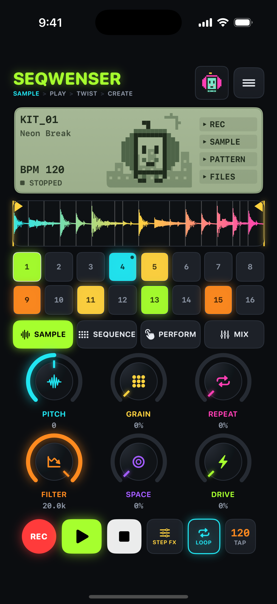
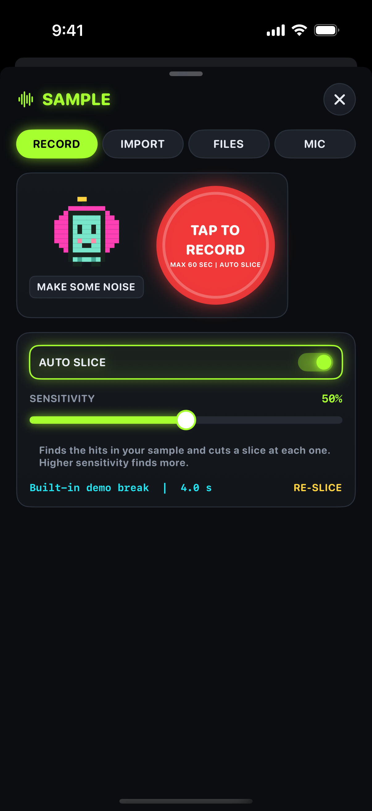
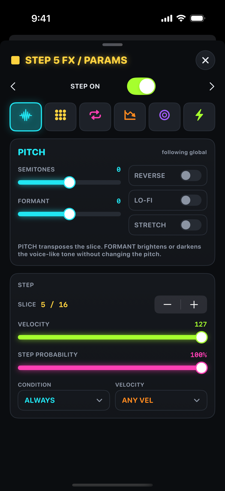
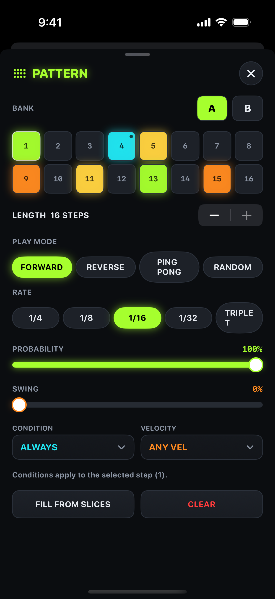

# Seqwenser

A hardware-sampler-style **iPhone app**. Import or record audio, auto-slice it, play the slices on a 16-step sequencer
and twist them with six effect macros (PITCH, GRAIN, REPEAT, FILTER, SPACE, DRIVE). Every step can carry its own
parameter locks. Status: **v0.1, work in progress**, built and tested in CI on the iOS simulator; not yet tried on a device.

## Features (v0.1)
- Import any audio: Files picker, drag and drop, "Open in / Share to" Seqwenser. Decoding by AVFoundation (WAV, AIFF, MP3, M4A, FLAC, CAF).
- Mic recording (up to 60 s), then auto-slice (onset detection with a SENSITIVITY control, or 16 equal slices).
- Waveform with draggable yellow trim markers.
- 16-step sequencer: Bank A/B, length, play modes (Forward, Reverse, Ping Pong, Random), rates (1/4, 1/8, 1/16, 1/32, Triplet), swing, global probability, per-step probability and conditions (ALWAYS, EVERY 2ND/4TH, FIRST, NOT FIRST, 50/50, VEL > 50, VEL < 50).
- Per-step parameter locks for all six effects, plus per-step REVERSE / LO-FI / STRETCH.
- Real-time audio: an `AVAudioSourceNode` render callback calls the C++ engine directly (5 ms IO buffer, no allocation on the audio thread).
- Save and load projects locally (folder with `project.json` + 24-bit `sample.wav`), export a bounce as WAV and share it.
- Not in v0.1: MIDI, Audiobus, Ableton Link, AU/Logic plug-in (later target, `plugin/`).

## Layout
| Path | What |
|---|---|
| `core/` | Portable C++17 DSP + sampler engine, plain C API (`core/capi`), unit tests (CMake, runs on Linux) |
| `Sources/SeqwenserKit/` | Swift model, project store, WAV I/O, engine wrapper (no UI, tests run on Linux/macOS) |
| `App/Seqwenser/` | SwiftUI app (UI, audio I/O, app model) |
| `App/SeqwenserTests/` | Simulator unit tests |
| `App/project.yml` | XcodeGen spec (`xcodegen generate --spec App/project.yml --project App`) |
| `plugin/` | JUCE AU plug-in, the later Logic target |
| `docs/` | `ENGINE.md`, `LICENSES.md`, `TESTFLIGHT.md` |

## Build and test
```
# engine tests (any OS)
cmake -S . -B build-core -G Ninja -DMANGLE_BUILD_PLUGIN=OFF -DMANGLE_BUILD_TESTS=ON
cmake --build build-core && ctest --test-dir build-core
# Swift kit tests
swift test
# iOS app (macOS + Xcode 15+)
brew install xcodegen && xcodegen generate --spec App/project.yml --project App
open App/Seqwenser.xcodeproj      # pick your team under Signing, run on device
```
CI (`.github/workflows/ios.yml`) does all of this on `macos-14`, runs the app tests on an iPhone simulator, and uploads screenshots.

Licence: GNU AGPL v3.0, see `docs/LICENSES.md`.

## Screenshots (iPhone 15 Pro simulator, from CI)
| Main | Sample | Step FX | Pattern |
|---|---|---|---|
|  |  |  |  |
